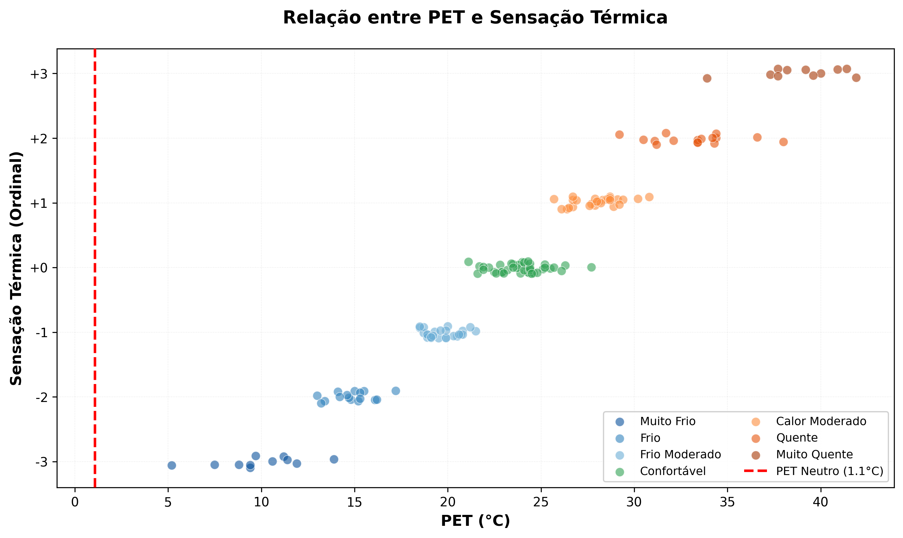

# Relatório de Calibração PET - Conforto Térmico

**Autora**: Carol Freire do Santos  
**Instituição**: Universidade de São Paulo (USP)  
**Programa**: Doutorado em Climatologia  
**Data de Geração**: 2025-11-10 11:24:17

---

## 1. Resumo dos Dados

- **Total de respostas**: 150
- **Respostas válidas**: 150 (100.0%)
- **PET médio**: 24.0°C (DP: 7.6°C)
- **PET mediana**: 24.1°C
- **Intervalo PET**: [5.2, 41.9]°C

### Distribuição de Sensação Térmica

| Categoria | Valor Ordinal | N Respostas | % |
|-----------|---------------|-------------|---|
| Muito Frio | -3 | 11 | 7.3% |
| Frio | -2 | 16 | 10.7% |
| Frio Moderado | -1 | 27 | 18.0% |
| Confortável | +0 | 42 | 28.0% |
| Calor Moderado | +1 | 27 | 18.0% |
| Quente | +2 | 16 | 10.7% |
| Muito Quente | +3 | 11 | 7.3% |


## 2. Modelo Ordinal

### Parâmetros Estimados

**Coeficiente β (PET_C)**:

- Estimativa: **2.1641**
- Erro padrão: 0.3190
- IC 95%: [1.5388, 2.7893]

**Limiares (Cutpoints) τ_k**:

| Limiar | Estimativa | Erro Padrão | IC 95% |
|--------|------------|-------------|---------|
| τ_-3 | 2.1482 | 0.1854 | [1.7849, 2.5115] |
| τ_-2 | 2.2938 | 0.2077 | [1.8867, 2.7009] |
| τ_-1 | 27.7411 | 4.3127 | [19.2884, 36.1938] |
| τ_+0 | 2.3433 | 0.1651 | [2.0196, 2.6670] |
| τ_+1 | 2.1940 | 0.1790 | [1.8433, 2.5448] |
| τ_+2 | 2.6208 | 0.1936 | [2.2413, 3.0002] |

### Qualidade do Ajuste

- **Convergência**: ✓ Sim
- **N observações**: 150
- **Log-verossimilhança**: -37.14
- **AIC**: 88.28
- **BIC**: 109.35

### Interpretação do Modelo

O modelo de regressão logística ordinal proporcional relaciona o PET 
com a sensação térmica usando a função de ligação logit:

```
logit(P(Y ≤ k | PET)) = τ_k - β × PET
```

O coeficiente β = 2.1641 indica que cada aumento de 1°C no PET 
está associado a um aumento na probabilidade de sensações mais quentes.


## 3. PET Neutro

**PET Neutro = 1.1°C**

- **Intervalo de Confiança 95%**: [0.7, 1.4]°C
- **Erro Padrão**: 0.18°C

O PET neutro representa a temperatura equivalente onde a sensação 
"confortável" (categoria 0) é mais provável. Este valor é calculado 
como o ponto médio entre as categorias de conforto no modelo ordinal 
(τ₀ / β).

## 4. Faixas de Conforto

As faixas de conforto representam os intervalos de PET onde a probabilidade 
combinada das categorias centrais (-1: Frio Moderado, 0: Confortável, 
+1: Calor Moderado) atinge os limiares especificados.

### Faixa de Conforto 80%

⚠️ Não foi possível determinar a faixa de 80% com os dados disponíveis.

### Faixa de Conforto 90%

⚠️ Não foi possível determinar a faixa de 90% com os dados disponíveis.

## 5. Faixas de PET por Categoria de Sensação

Esta seção apresenta as faixas de PET características para cada categoria 
de sensação térmica, baseadas no modelo probabilístico calibrado.


Para cada categoria, são apresentadas:

- **Faixa Modal**: Intervalo de PET onde esta sensação é a mais provável

- **Faixa de Probabilidade ≥30%**: Intervalo onde a probabilidade desta sensação é ≥30%

- **Dados Observados**: Estatísticas descritivas do PET quando esta sensação foi reportada


### Resumo das Faixas de PET


| Sensação | Faixa Modal (°C) | Pico PET (°C) | PET Observado Médio (°C) | N Obs. |

|----------|------------------|---------------|--------------------------|--------|

| Muito Frio (-3) | [-5.0, 1.0] | -5.0 | 9.9 | 11 |

| Frio (-2) | — | — | 14.9 | 16 |

| Frio Moderado (-1) | [1.0, 6.7] | 6.7 | 19.7 | 27 |

| Confortável (+0) | — | — | 23.9 | 42 |

| Calor Moderado (+1) | — | — | 28.0 | 27 |

| Quente (+2) | — | — | 33.2 | 16 |

| Muito Quente (+3) | [6.7, 55.0] | 18.5 | 38.9 | 11 |


### Detalhamento por Categoria


#### Muito Frio (-3)


**Faixa Modal**: [-5.0, 1.0]°C  

- Pico de probabilidade em -5.0°C 
(P = 100.0%)  

- Amplitude: 6.0°C


**Faixa com P ≥ 30%**: [-5.0, 1.3]°C  

- Amplitude: 6.3°C


**Dados Observados** (n = 11):  

- Média: 9.9°C (DP: 2.3°C)  

- Mediana: 9.7°C  

- Intervalo: [5.2, 13.9]°C  

- Percentis 25-75: [9.1, 11.3]°C


#### Frio (-2)


**Faixa Modal**: Não identificada (sensação nunca é a mais provável)


**Faixa com P ≥ 30%**: Não identificada


**Dados Observados** (n = 16):  

- Média: 14.9°C (DP: 1.1°C)  

- Mediana: 14.9°C  

- Intervalo: [13.0, 17.2]°C  

- Percentis 25-75: [14.2, 15.4]°C


#### Frio Moderado (-1)


**Faixa Modal**: [1.0, 6.7]°C  

- Pico de probabilidade em 6.7°C 
(P = 100.0%)  

- Amplitude: 5.6°C


**Faixa com P ≥ 30%**: [0.7, 13.2]°C  

- Amplitude: 12.5°C


**Dados Observados** (n = 27):  

- Média: 19.7°C (DP: 0.9°C)  

- Mediana: 19.5°C  

- Intervalo: [18.5, 21.5]°C  

- Percentis 25-75: [18.9, 20.4]°C


#### Confortável (+0)


**Faixa Modal**: Não identificada (sensação nunca é a mais provável)


**Faixa com P ≥ 30%**: Não identificada


**Dados Observados** (n = 42):  

- Média: 23.9°C (DP: 1.4°C)  

- Mediana: 24.1°C  

- Intervalo: [21.1, 27.7]°C  

- Percentis 25-75: [22.9, 24.5]°C


#### Calor Moderado (+1)


**Faixa Modal**: Não identificada (sensação nunca é a mais provável)


**Faixa com P ≥ 30%**: Não identificada


**Dados Observados** (n = 27):  

- Média: 28.0°C (DP: 1.2°C)  

- Mediana: 28.1°C  

- Intervalo: [25.7, 30.8]°C  

- Percentis 25-75: [26.8, 28.7]°C


#### Quente (+2)


**Faixa Modal**: Não identificada (sensação nunca é a mais provável)


**Faixa com P ≥ 30%**: Não identificada


**Dados Observados** (n = 16):  

- Média: 33.2°C (DP: 2.2°C)  

- Mediana: 33.4°C  

- Intervalo: [29.2, 38.0]°C  

- Percentis 25-75: [31.6, 34.3]°C


#### Muito Quente (+3)


**Faixa Modal**: [6.7, 55.0]°C  

- Pico de probabilidade em 18.5°C 
(P = 100.0%)  

- Amplitude: 48.2°C


**Faixa com P ≥ 30%**: [0.8, 55.0]°C  

- Amplitude: 54.1°C


**Dados Observados** (n = 11):  

- Média: 38.9°C (DP: 2.3°C)  

- Mediana: 39.2°C  

- Intervalo: [33.9, 41.9]°C  

- Percentis 25-75: [37.7, 40.5]°C


## 6. Faixas de PET Observadas (Análise Descritiva)


Esta análise apresenta as faixas de PET baseadas diretamente nos dados 
coletados, sem depender de modelagem probabilística.


### Resumo das Faixas Observadas


| Sensação | N | Média (°C) | Faixa 50% (°C) | Faixa 80% (°C) |

|----------|---|------------|----------------|----------------|

| Muito Frio (-3) | 11 | 9.9 | [9.1, 11.3] | [7.5, 11.9] |

| Frio (-2) | 16 | 14.9 | [14.2, 15.4] | [13.3, 16.1] |

| Frio Moderado (-1) | 27 | 19.7 | [18.9, 20.4] | [18.7, 20.8] |

| Confortável (+0) | 42 | 23.9 | [22.9, 24.5] | [21.9, 25.5] |

| Calor Moderado (+1) | 27 | 28.0 | [26.8, 28.7] | [26.5, 29.3] |

| Quente (+2) | 16 | 33.2 | [31.6, 34.3] | [30.8, 35.5] |

| Muito Quente (+3) | 11 | 38.9 | [37.7, 40.5] | [37.3, 41.4] |


### Zona de Conforto Observada


- Faixa Central (50%): [22.9, 24.5]°C

- Faixa Ampla (80%): [21.9, 25.5]°C

- PET médio: 23.9°C


💡 **Nota**: Faixas baseadas exclusivamente nos dados observados.


## 7. Faixas de Aceitabilidade (Análise Complementar)

As faixas de aceitabilidade são baseadas em um modelo logístico binário 
separado e fornecem uma perspectiva complementar sobre o conforto térmico.

## 6. Visualizações

### Relação PET vs Sensação Térmica



Gráfico de dispersão mostrando a relação entre PET e sensação 
térmica ordinal. A linha vertical vermelha indica o PET neutro.

### Curvas de Probabilidade por Categoria


Probabilidades de cada categoria de sensação térmica em função 
do PET. As regiões sombreadas indicam as faixas de conforto 
(80% e 90%).

### Zona de Conforto Térmico


Probabilidade de conforto (P(-1 ≤ Y ≤ +1)) em função do PET. 
As linhas horizontais indicam os limiares de 80% e 90%, e as 
linhas verticais marcam os limites das faixas de conforto.

## 7. Interpretação dos Resultados

### Como usar as faixas de conforto

1. **Faixa 80%**: Recomendada para aplicações gerais de planejamento 
   urbano e design de espaços externos. Garante que a maioria das 
   pessoas (80%) se sentirá confortável.

2. **Faixa 90%**: Recomendada para espaços que requerem maior rigor 
   de conforto, como áreas de permanência prolongada ou populações 
   sensíveis.

3. **PET Neutro**: Representa a temperatura ideal de conforto térmico 
   para a população estudada. Pode ser usado como referência para 
   estratégias de mitigação térmica.

### Limitações e considerações

- Os resultados são específicos para a população e contexto climático 
  estudados. Extrapolações para outras regiões devem ser feitas com cautela.

- O modelo assume proporcionalidade dos odds (proportional odds assumption). 
  Violações desta suposição podem afetar a precisão das estimativas.

- O tamanho amostral (N = 150) influencia a precisão 
  dos intervalos de confiança. Amostras maiores produzem estimativas 
  mais precisas.

## 8. Referências

### Metodologia Estatística

- **McCullagh, P.** (1980). Regression Models for Ordinal Data. 
  *Journal of the Royal Statistical Society: Series B*, 42(2), 109-127.

- **Agresti, A.** (2010). *Analysis of Ordinal Categorical Data* 
  (2nd ed.). Wiley.

### Índice PET

- **Höppe, P.** (1999). The physiological equivalent temperature - 
  a universal index for the biometeorological assessment of the thermal 
  environment. *International Journal of Biometeorology*, 43(2), 71-75.

- **Matzarakis, A., Mayer, H., & Iziomon, M. G.** (1999). Applications 
  of a universal thermal index: physiological equivalent temperature. 
  *International Journal of Biometeorology*, 43(2), 76-84.

### Conforto Térmico

- **ASHRAE** (2020). *ASHRAE Standard 55: Thermal Environmental 
  Conditions for Human Occupancy*. American Society of Heating, 
  Refrigerating and Air-Conditioning Engineers.

- **ISO 7730** (2005). *Ergonomics of the thermal environment - 
  Analytical determination and interpretation of thermal comfort using 
  calculation of the PMV and PPD indices and local thermal comfort criteria*. 
  International Organization for Standardization.

---

*Relatório gerado automaticamente pelo PET Thermal Comfort Calibrator*  
*Desenvolvido por Carol Freire do Santos - Doutorado em Climatologia, USP*
